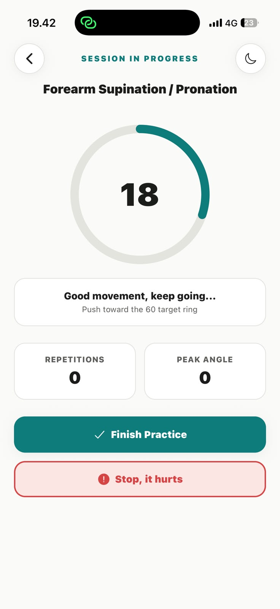
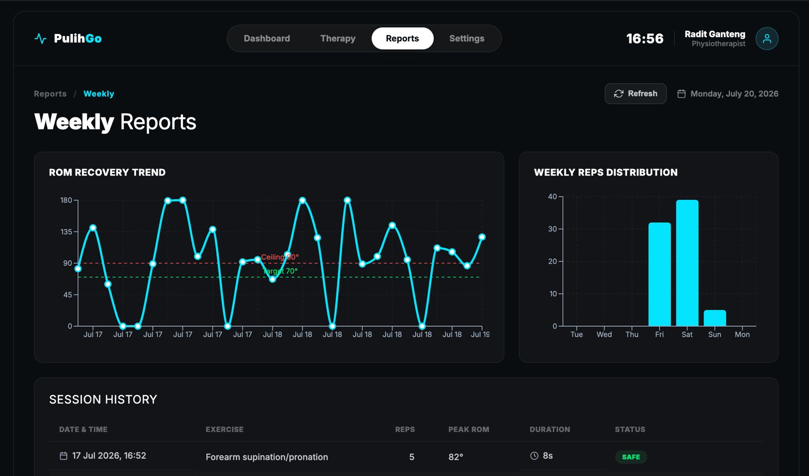
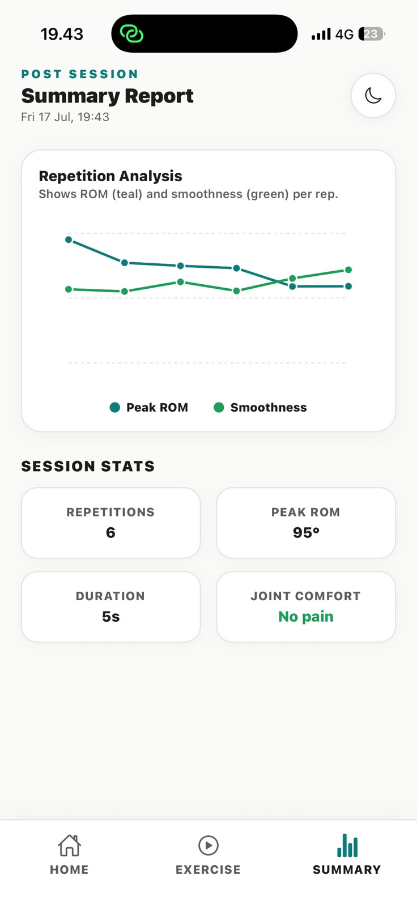

<div align="center">

# PulihGo 🩺📱

**Gyroscope-based home stroke rehabilitation.**
Turn any phone into an objective range-of-motion sensor and a rehab coach — no extra hardware.

<br/>


*"Pulih" = recover (Indonesian) + "Go"*

**The app MEASURES · the therapist PRESCRIBES · the patient PRACTISES.**

</div>

---

## 📸 Preview

<!-- Drop the screenshots into .github/assets/ with these exact names and this
     section renders on the GitHub homepage. See "Capturing the screenshots" below. -->

| Exercise (live) | Therapist dashboard | Session summary |
|:---:|:---:|:---:|
|  |  |  |
| Live angle, reps & ROM on-device | Prescribe target + ROM trend chart | Per-session report |

> **The money shot for the top of this section is a short GIF of the two-way loop**
> — therapist types a target on the laptop → the phone starts coaching to it → the
> session lands in the dashboard chart. Save it as `.github/assets/loop.gif` and add
> it right under the "Preview" heading.

---

## The idea in 20 seconds

Motor recovery after a stroke needs **hundreds of repetitions during a short
window**, but a real outpatient session delivers about **12 useful arm
movements**, and home practice fails from boredom and no feedback. PulihGo
straps a phone to the forearm, uses the **gyroscope** to measure how far the limb
rotates (in degrees), counts reps, scores movement quality, and streams progress
to the therapist — who sets the target from a dashboard, and sees whether the
patient actually practised.

Rehab exercises are fundamentally *rotational*. Rotation is angular velocity,
which the gyroscope measures directly and the accelerometer barely sees. That is
the whole bet.

## Status — what actually works

| | |
|---|---|
| 🟢 **Measurement** | Calibrated forearm angle on-device, rep counting, peak ROM in degrees, jerk-based smoothness. All computed in TypeScript on the phone — no ML, no DSP library. |
| 🟢 **Safety** | ROM ceiling warning + a one-tap "Stop — it hurts" that ends and flags the session. |
| 🟢 **Offline-first** | A session saves to the device **before** any network call. Upload is best-effort; a dead network never stops a patient practising. |
| 🟢 **Two-way loop** | Therapist sets the plan on the dashboard → the phone reads it on launch (server → cache → default) → results sync back → the dashboard charts them. |
| ⚪ **Not built** | The game layer, accounts/auth, raw-signal archiving, more than one exercise. |

**Honest boundaries:** this is a therapy-support and monitoring aid. It does not
diagnose, it does not replace a therapist, and its degrees are not yet validated
against a clinical goniometer. See
[`docs/01-concept-brief.md`](./pulihgo-app/docs/01-concept-brief.md) §5.

---

## Run it (5 min)

**Two apps, two terminals**, running at the same time. They never talk to each
other directly — both talk to Supabase.

### Before you start
- **Node.js LTS** — [nodejs.org](https://nodejs.org)
- **Expo Go** on your phone (App Store / Play Store) — this project targets **SDK 54**
- Laptop + phone on the **same wifi**

### 1. Open the project

```bash
git clone https://github.com/radityawsgtg/GARUDA7.0.git
cd GARUDA7.0
```

```
GARUDA7.0/
├── pulihgo-app/          ← the phone app     (Terminal 1)
└── therapist-dashboard/  ← the web dashboard (Terminal 2)
```

> ⚠️ **The repo root has no `package.json`.** Every command below runs *inside*
> one of those two folders. Running `npx expo start` from the root fails with
> `ConfigError: The expected package.json path ... does not exist`.

### 2. Terminal 1 — the patient app 📱

```bash
cd pulihgo-app
npm install           # .npmrc already sets legacy-peer-deps
npx expo start        # a QR code appears — leave this running
```

Scan the QR with **Expo Go** (iPhone: the Camera app; Android: scan from inside
Expo Go). Hot reload is on — save a file, the phone updates in ~1s.

> The iOS **simulator has no gyroscope**. Anything sensor-related needs a
> physical phone.

### 3. Terminal 2 — the therapist dashboard 💻

Open a **second** terminal; leave Expo running in the first.

```bash
cd therapist-dashboard
npm install
npm run dev           # → http://localhost:5173
```

### 4. See the loop close

1. **Dashboard → Therapy** → set a **Target ROM** → *Update Prescription*
2. **Phone** → restart Expo Go → the exercise list shows **that** target
3. **Phone → Calibrate & Start** → strap it to your forearm, rotate palm up/down a few times → **Finish** → answer the pain check
4. **Dashboard → Reports → Refresh** → your session appears in the chart

Refresh is manual on purpose — there is no realtime subscription.

### Optional — cloud sync

Sync is **off** until you add credentials, and the app runs fine without them:
fully local, one console warning. To enable it, copy each project's
`.env.example` to `.env`:

| File | Variables |
|------|-----------|
| `pulihgo-app/.env` | `EXPO_PUBLIC_SUPABASE_URL`, `EXPO_PUBLIC_SUPABASE_ANON_KEY` |
| `therapist-dashboard/.env` | `VITE_SUPABASE_URL`, `VITE_SUPABASE_ANON_KEY` |

Same Supabase project, same anon key — **different variable names**. Expo only
inlines `EXPO_PUBLIC_*`; Vite only inlines `VITE_*`. Restart the dev server after
editing; neither hot-reloads `.env`.

> ### ⛔ After every `git pull`: `npm install`
> When a teammate adds a dependency your `node_modules` goes stale, and the error
> never mentions installing — e.g. `Unable to resolve module expo-av`. The fix is
> always `npm install` in that folder, never a code change.

Full setup, and the errors we already hit, in
[`pulihgo-app/docs/07-getting-started.md`](./pulihgo-app/docs/07-getting-started.md).

---

## How it's built

```
📱 pulihgo-app          Expo SDK 54 · React Native · TypeScript
     expo-sensors ──→ calibrated angle ──→ reps · ROM · smoothness
     └─ saved to AsyncStorage first, uploaded best-effort
              ↓ sessions              ↑ prescriptions
🗄️ Supabase             Postgres + PostgREST — no API server of our own
              ↓ sessions              ↑ prescriptions
💻 therapist-dashboard  React · Vite · Recharts
```

Full diagrams in [`docs/02-architecture.md`](./pulihgo-app/docs/02-architecture.md);
schema in [`docs/03-database.md`](./pulihgo-app/docs/03-database.md).

## What to read, in order

| File | What it is |
|------|-----------|
| [`pulihgo-app/AGENTS.md`](./pulihgo-app/AGENTS.md) | **AI agents + new teammates start here.** Glossary, guardrails, conventions. |
| [`docs/07-getting-started.md`](./pulihgo-app/docs/07-getting-started.md) | Install, run on your phone, the SDK/npm fixes. |
| [`docs/01-concept-brief.md`](./pulihgo-app/docs/01-concept-brief.md) | Problem, solution, business, **boundaries**. |
| [`docs/02-architecture.md`](./pulihgo-app/docs/02-architecture.md) | Tech stack + data-flow diagrams. |
| [`docs/06-feature-spec.md`](./pulihgo-app/docs/06-feature-spec.md) | Every feature + how each works. |
| [`docs/04-research-references.md`](./pulihgo-app/docs/04-research-references.md) | Every clinical claim, with its source. |
| [`docs/05-doctor-interview-guide.md`](./pulihgo-app/docs/05-doctor-interview-guide.md) | Questions to validate with a clinician. |
| [`docs/03-database.md`](./pulihgo-app/docs/03-database.md) | What's live, and the schema it grows into. |
| [`docs/08-sprint-plan.md`](./pulihgo-app/docs/08-sprint-plan.md) | Roles, folder ownership, the 30-hour plan. |
| [`pulihgo-app/CONTRIBUTING.md`](./pulihgo-app/CONTRIBUTING.md) | How we branch, split work, and merge. |

## End goal

A clinician-prescribed home-rehab tool that measurably increases practice dose
and gives therapists objective remote progress data — starting from this one
honest, gyroscope-measured exercise. Depth on the core beats breadth on five
broken features.

---

## Capturing the screenshots

The Preview section renders once these files exist. Create `.github/assets/`
and drop them in — no build step, GitHub just shows them.

| File | What to capture | How |
|------|-----------------|-----|
| `exercise.png` | Exercise screen mid-session — big angle number, reps, ROM | Phone screenshot while practising (the hero image) |
| `dashboard.png` | Dashboard **Reports** tab — the ROM trend chart | Browser screenshot at `localhost:5173` |
| `summary.png` | Session summary after Finish | Phone screenshot |
| `loop.gif` | The two-way loop: dashboard target → phone → chart updates | Screen-record the demo, trim to ~8s, export GIF |

Tips: portrait phone shots read best in the 3-column table; keep each under
~500 KB (a binary in git is forever); avoid any real patient data — the demo
uses `patient_id = 'demo01'`, so you're safe. Do **not** screenshot a session
with an impossible reading (e.g. a 180° "rotation" from spinning the phone) —
clear those first.

## Credits

Built by **Raditya, Pradipta, Sulthan, and Adnan** for **Garuda Hacks 7.0** —
🏆 **1st Place, Health Track**.
