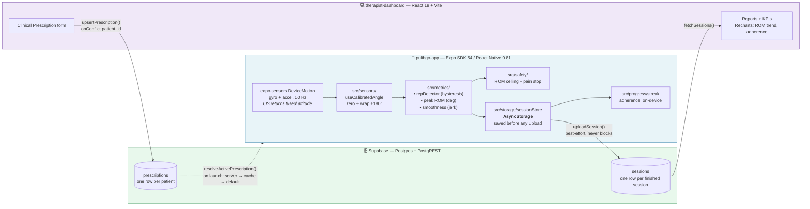
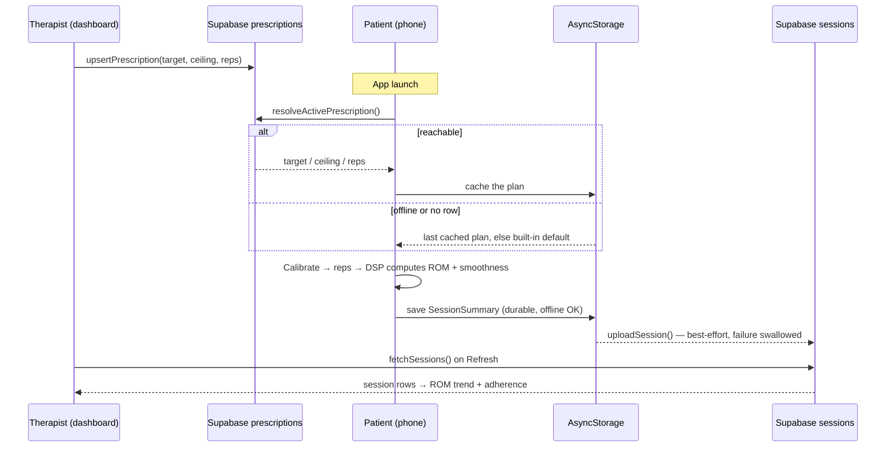

# PulihGo — Architecture

What is actually built, and how the two halves talk.

> **This describes the shipped system.** An earlier version of this file
> described Hono on Cloudflare Workers, D1, R2 and an `apps/` + `packages/`
> monorepo. None of that was ever built — we went with Supabase instead and the
> doc was never updated. If you are looking for the reasoning, see
> [Why Supabase, not Cloudflare](#why-supabase-not-cloudflare-workers--d1) below.

---

## The one-line model

> **The app MEASURES · the therapist PRESCRIBES · the patient PRACTISES.**

Two repos, one database, no backend of our own. Measurements flow **up** from the
phone to the therapist; the plan flows **down** from the therapist to the phone.
Neither direction may ever block a practice session.

---

## System flowchart



---

## Component responsibilities

### `pulihgo-app/` — the patient app (the hard/novel part)

| Path | Does |
|------|------|
| `src/sensors/` | `useDeviceAngle` reads `DeviceMotion` at 50 Hz; `useCalibratedAngle` subtracts the calibration zero and wraps to (−180, 180]. `mockAngle` lets metrics be built without a phone. |
| `src/metrics/` | `repDetector` (hysteresis; thresholds derived from the prescribed target ROM), `rom`, `smoothness` (3rd-difference jerk → 0..1). |
| `src/safety/` | ROM ceiling check + pain options. |
| `src/storage/` | `sessionStore` — AsyncStorage-backed, sync reads off an in-memory cache, `useSessions()` for live screens. |
| `src/progress/` | `streak` — pure adherence functions over `SessionSummary[]`. |
| `src/sync/` | `uploadSession` (up), `fetchPrescription` + `usePrescription` (down). Both best-effort. |
| `src/exercises/` | `exerciseLibrary` — the exercise catalogue. Ships exactly one. |
| `src/types.ts` | The shared contract. |

**We do not write a sensor fusion filter.** The earlier plan budgeted the most
time for a complementary/Madgwick filter; in practice `DeviceMotion.rotation`
returns an attitude the OS has already fused from gyro + accel, so
`useCalibratedAngle` only has to zero it and wrap it. This is the single biggest
difference between the original plan and the built system.

### Supabase — the whole backend

No API server of our own. Both clients speak to PostgREST directly with the
**anon key**; access is meant to be constrained by Row Level Security on the
table, not by a secret.

**`sessions`** — written by the phone, read by the dashboard. The phone is the
only author; the dashboard never writes here.

```
id · patient_id · reps · peak_rom · duration_ms · pain_flag · created_at
```

**`prescriptions`** — written by the dashboard, read by the phone. `patient_id`
is UNIQUE: one active prescription per patient, upserted on conflict.

```
id · patient_id · target_rom · rom_ceiling · target_reps · exercise · updated_at
```

Note `sessions` stores **per-session aggregates**, not per-rep rows and not raw
signal. The full `RepMetric[]` and the raw sample buffer stay on the phone.

### `therapist-dashboard/` — React 19 + Vite

`src/lib/supabase.ts` holds the client and every query: `fetchSessions`,
`fetchPrescription`, `upsertPrescription`. `src/App.tsx` renders Reports/KPIs
from real session data and the Clinical Prescription form. Refresh is manual —
no realtime subscription.

---

## Data flow — one practice session



**The rule this encodes:** the session is durable on the phone *before* any
network call happens, and the prescription resolves within a bounded timeout
(server → cache → default). A dead network degrades the product; it never stops
a patient practising. That is AGENTS.md guardrail 6, in code.

---

## Why Supabase, not Cloudflare Workers + D1

The original plan (Hono + Workers + D1 + R2, shared types in a monorepo) was a
reasonable design that we did not build. What we actually needed was a database
two clients could reach, and Supabase gave us Postgres + a generated REST API +
RLS with **no API layer to write** — which is why the full two-way loop landed
inside the sprint. Every hour not spent writing CRUD endpoints went into the
sensor path, which is the part nobody else can copy.

**What we gave up, honestly:**

- **No shared types package.** `SessionSummary` on the phone and `DbSession` in
  the dashboard are declared separately and kept in step by hand. The
  `uploadSession` insert and the `fetchSessions` select must agree; nothing but
  review enforces that today.
- **No raw signal storage.** R2 was going to hold the 50 Hz time-series for
  later validation (feature 22). Nothing stores it — the raw buffer dies with
  the session.
- **No auth.** Everything is `patient_id = 'demo01'`, hardcoded in both
  `uploadSession.ts` and the dashboard. Anyone with the anon key can read and
  write that table. Fine for a demo; not fine for a patient.

If the exercise library or the patient count grows, the shared-types gap is the
first thing that will bite.

---

## Build order — as it actually happened

| # | Step | Proved |
|---|------|--------|
| 1 | Sensor loop → live angle on screen | **The gyroscope works** — the biggest risk, killed first |
| 2 | Calibration (zero + wrap) | Degrees mean the same thing every session |
| 3 | Rep detection + peak ROM | The headline number exists |
| 4 | Smoothness | Quality, not just quantity |
| 5 | Session save + AsyncStorage persistence | Sessions survive a restart |
| 6 | Safety: ROM ceiling + pain stop | The "could it make things worse?" answer |
| 7 | Streak + progress view | Adherence, fully offline |
| 8 | `uploadSession` → Supabase `sessions` | Data leaves the phone |
| 9 | Dashboard reads real sessions (Recharts) | The therapist value + the demo cut |
| 10 | Dashboard writes `prescriptions` | The therapist can set the plan |
| 11 | Phone reads `prescriptions` (server → cache → default) | **The loop closes, offline-first intact** |

Steps 1–2 are the proof the whole idea rests on. Steps 9–11 are the tele-rehab
story. The game layer (feature 13) is still not built, and is still last.

---

## Known gaps

- **`EXERCISE_AXIS` is verified; the ROM ceiling number is not.** The default 90°
  is at or above what a forearm can physically supinate (~85–90°), so the safety
  warning may never fire. The real number is clinical — see question 15 in
  [`05-doctor-interview-guide.md`](./05-doctor-interview-guide.md).
- **Rep thresholds and the smoothness scale are still untuned** against real
  captured data — both are marked `TODO(tune)`.
- **One exercise.** `exerciseLibrary` holds a single entry, and
  `romCeilingDeg` is per-exercise in the type but a shared constant in
  `safety.ts` — that has to be reconciled before a second measured exercise
  ships (see feature 14's honesty rule).
