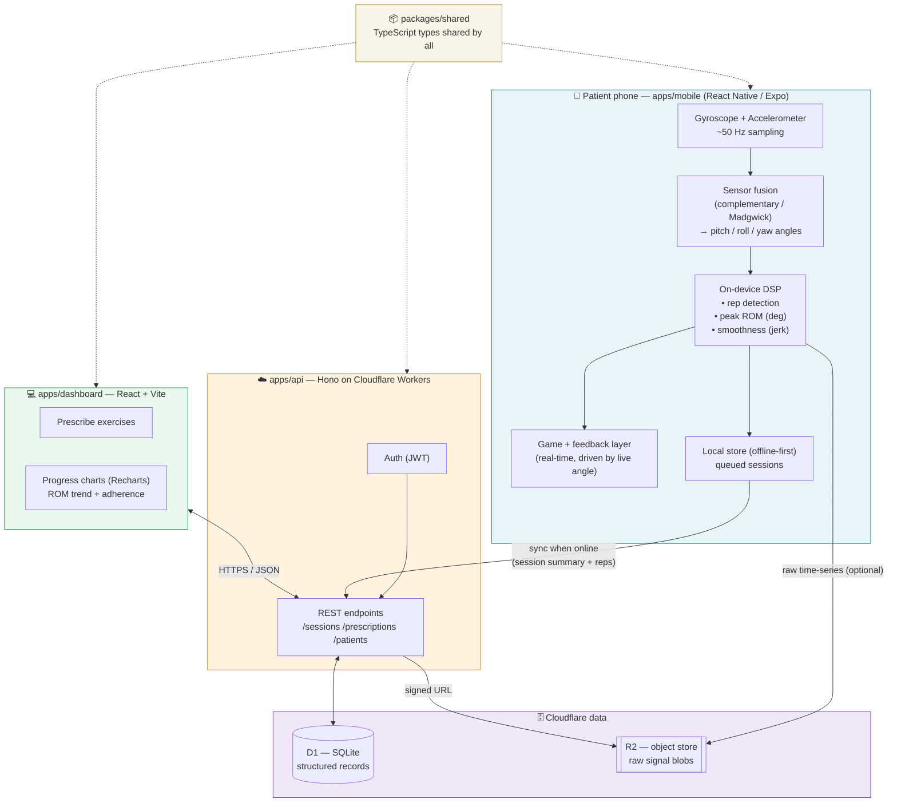
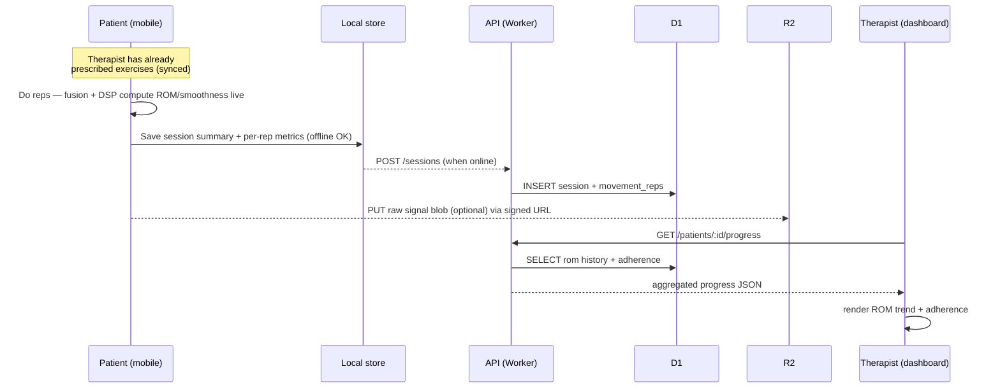

# PulihGo — Architecture

Tech-stack flowchart, component responsibilities, and build order.

---

## System flowchart

---

## Component responsibilities

### `apps/mobile` — the patient app (the hard/novel part)
- Sample gyroscope + accelerometer via `expo-sensors`.
- **Sensor fusion**: fuse both into a stable joint angle (pitch/roll/yaw). This
  is the one piece of genuinely new engineering — budget the most time here.
- **Rep detection**: segment the continuous angle stream into individual reps
  (peak-to-peak or zero-crossing of angular velocity).
- **Metrics per rep**: `peak_rom_deg`, `smoothness` (from jerk), `duration_ms`.
- **Game**: map live angle → on-screen action; give "good / further / slower" cues.
- **Offline-first**: persist a full session locally; sync later.

### `apps/api` — Hono on Cloudflare Workers
- Auth (JWT), thin REST layer.
- Write session summaries + per-rep metrics to **D1**.
- Store optional raw time-series to **R2**, keyed by `session_id`.
- Serve the dashboard's queries (patients, prescriptions, progress aggregates).

### `apps/dashboard` — React + Vite
- Therapist prescribes exercises (which, how many reps/sets, how often).
- Progress charts (Recharts): ROM-over-time line, adherence calendar, per-session drill-down.

### `packages/shared`
- The canonical TypeScript types + enums (`Exercise`, `Session`, `RepMetric`,
  `MovementType`, etc.). Every app imports from here — never redefines.

---

## Data-flow (happy path, one practice session)

---

## Build order (do not reorder)

| # | Step | Proves |
|---|------|--------|
| 1 | `packages/shared` core types | Shared contract exists |
| 2 | Mobile sensor loop → live angle on screen | **Gyroscope actually works** (kills the biggest risk first) |
| 3 | On-device rep + peak-ROM detection | We can produce the headline number |
| 4 | Smoothness metric | Movement *quality*, not just quantity |
| 5 | `api` + D1 schema + `POST /sessions` | Data persists |
| 6 | Offline queue + sync | Real-world robustness |
| 7 | Dashboard: ROM trend + adherence (seed demo data) | The therapist value + the demo cut |
| 8 | Game layer | Adherence engine + stage "wow" |

Step 8 is last on purpose: the game is polish. Steps 2–3 are the proof the whole
idea rests on — if the gyroscope can't read a clean angle, nothing else matters,
so validate it first.
