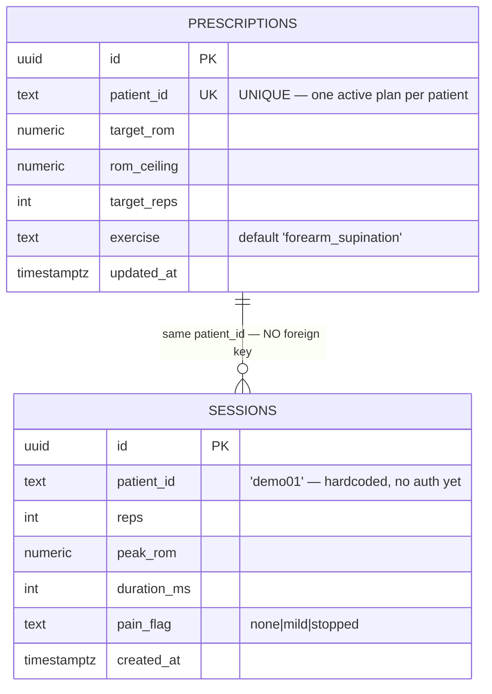
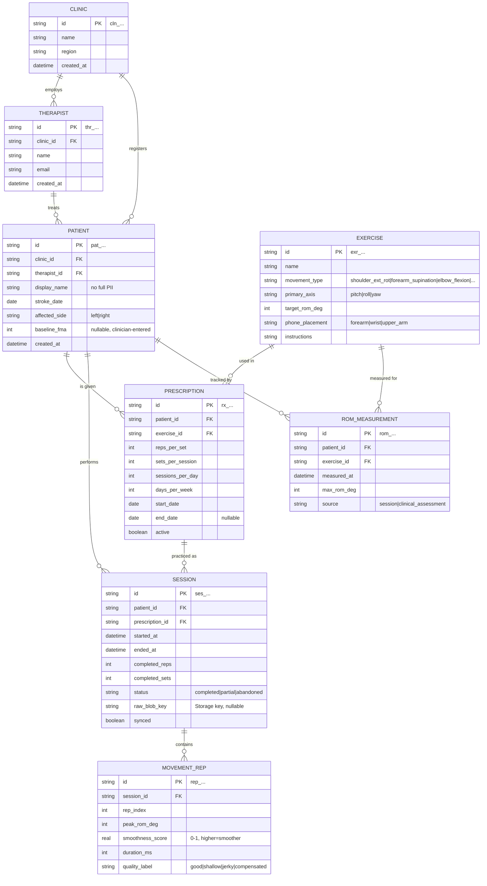
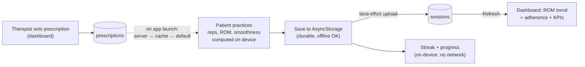

# PulihGo — Database

What is live today, and the schema it grows into.

> **Two things live in this file.** [Part 1](#part-1--what-is-live-today) is the
> database the app actually talks to right now. [Part 2](#part-2--the-target-schema-not-built)
> is the Phase-3 schema we designed for — useful for the pitch, but **not built**.
> An earlier version of this file described only Part 2, on Cloudflare D1 + R2,
> and read as if it existed. It never did.

---

# Part 1 — What is live today

**Supabase** (managed Postgres + PostgREST). No API server of our own: the phone
and the dashboard both speak to PostgREST directly with the anon key.

Two tables. That is the whole backend.



**There is no foreign key between them.** They are joined only by a `patient_id`
string that both clients hardcode. That is a direct consequence of having no auth
(feature 18), not an oversight to fix in isolation.

## Who writes what

| Table | Written by | Read by |
|-------|-----------|---------|
| `sessions` | **phone only** — `src/sync/uploadSession.ts` | dashboard — `fetchSessions()` |
| `prescriptions` | **dashboard only** — `upsertPrescription()` | phone — `resolveActivePrescription()` |

Each table has exactly one author. The dashboard never writes a session — only
the phone can measure one, so only the phone may author one. The phone never
writes a prescription — only a therapist prescribes. Keep it that way.

## Live DDL

`prescriptions`, as created:

```sql
create table prescriptions (
  id uuid primary key default gen_random_uuid(),
  patient_id text not null unique,   -- UNIQUE drives the upsert
  target_rom numeric not null,
  rom_ceiling numeric not null,
  target_reps integer not null,
  exercise text default 'forearm_supination',
  updated_at timestamptz default now()
);
```

`sessions` (columns confirmed against the live table; types as observed):

```sql
create table sessions (
  id uuid primary key default gen_random_uuid(),
  patient_id text not null,
  reps integer,
  peak_rom numeric,
  duration_ms integer,
  pain_flag text,                    -- 'none' | 'mild' | 'stopped'
  created_at timestamptz default now()
);
```

**`updated_at` is set explicitly by the client on every upsert.** `default now()`
only fires on INSERT, so without that an edited prescription would keep reporting
the time it was first created.

## ⚠️ RLS is OFF

Both tables were created with Row Level Security disabled. The comment in
`src/sync/supabaseClient.ts` says the anon key is "constrained by Supabase Row
Level Security policies on the table" — **today that is not true.** Anyone holding
the anon key has full read, write and delete on both tables, and the key ships
inside the app bundle and the dashboard's JS, so it is public by construction.

This is a demo posture, and it is acceptable *only* because the data is fake. It
is the one thing that must change before a single real patient's data goes in —
see feature 18.

## What is NOT stored

- **Per-rep metrics.** The phone computes a full `RepMetric[]` (index, peak ROM,
  duration, smoothness per rep) and keeps it in AsyncStorage. Only the session
  aggregate is uploaded.
- **Raw signal.** The 50 Hz × 3-axis buffer never leaves the device — it dies
  with the session. Feature 22 would put it in Supabase Storage. Until then,
  **the validation dataset for feature 24 is not being collected.**
- **Anything about a real person.** No names, no PII — just `'demo01'`.

## Local storage on the phone

Not Postgres, but part of the data story. Sessions live on the device in
**AsyncStorage** under `pulihgo.sessions.v1` as one JSON blob, written by
`src/storage/sessionStore.ts`. The prescription cache lives under
`pulihgo.prescription.v1`. The local copy is the source of truth; the upload is
best-effort on top of it.

---

# Part 2 — The target schema (NOT built)

Where this goes once there are real patients, therapists and clinics. Nothing
below exists yet — it is the design the two live tables are a subset of.



## Why the target schema looks like this

- **`display_name`, not full name.** Minimise PII in the app DB. Real identity, if
  needed, stays in the clinic's own records.
- **`MOVEMENT_REP` stores *aggregates* per rep**, not raw samples. The heavy
  time-series goes to object storage, referenced by `session.raw_blob_key`. Keeps
  queries fast, and the raw data is still there for research without bloating them.
- **`ROM_MEASUREMENT` is a separate progress table** so a therapist's manual
  clinical measurement (`source = clinical_assessment`) and the app's automatic
  reading (`source = session`) sit side by side and can be compared — that
  comparison **is** the validation story (feature 24).
- **`EXERCISE.primary_axis`** tells the app which fused angle to score, and
  `romCeilingDeg` is **per-exercise** for a reason: forearm supination tops out
  around 85–90°, elbow flexion reaches ~145°. One global ceiling constant — which
  is what `safety.ts` still has — is wrong for both.

## The gap, stated plainly

| Target | Live today |
|--------|-----------|
| 8 tables, real foreign keys | 2 tables, joined by a hardcoded string |
| clinics, therapists, patients | `patient_id = 'demo01'` |
| per-rep rows | session aggregates only |
| raw signal archive | nothing — the buffer is discarded |
| RLS scoping every row | RLS off |

Closing this gap is Phase 3, and it starts with auth (feature 18). Almost
everything above is blocked behind knowing who a row belongs to.

---

## Data lifecycle (as built)



The rule to preserve: **D completes before E is attempted, and nothing
downstream of D can block C.** A dead network degrades the product; it never
stops a patient practising.
