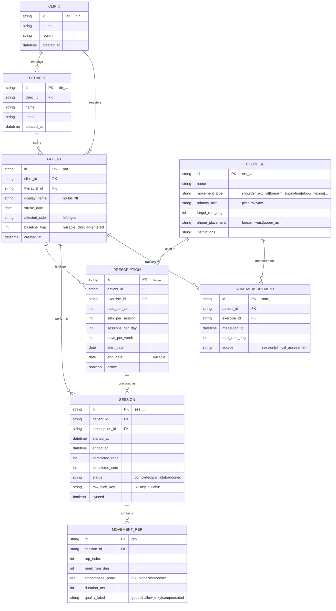
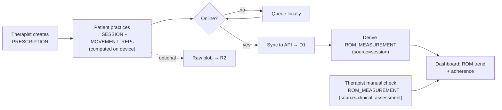

# PulihGo — Database

Schema, entity-relationship diagram, and the data lifecycle. Target store:
**Cloudflare D1** (SQLite) for structured data + **R2** for raw signal blobs.

---

## Entity-relationship diagram



---

## Why the schema looks like this

- **`display_name`, not full name.** Minimise PII in the app DB (see privacy
  guardrail in `AGENTS.md`). Real identity, if needed, stays in the clinic's own
  records.
- **`MOVEMENT_REP` stores *aggregates* per rep**, not raw samples. The heavy
  time-series (50 Hz × 3 axes) goes to **R2** as a blob referenced by
  `session.raw_blob_key`. Keeps D1 small and fast; raw data is there for research
  later without bloating queries.
- **`ROM_MEASUREMENT` is a separate progress table** so a therapist's manual
  clinical measurement (`source = clinical_assessment`) and the app's automatic
  reading (`source = session`) live side by side and can be compared — this
  comparison is your validation story.
- **`EXERCISE.primary_axis`** tells the mobile app which fused angle (pitch/roll/
  yaw) to score for that movement. Rotational exercises are the point.
- **String ULID PKs** are offline-mergeable and URL-safe.

---

## Raw signal storage (R2)

```
r2://pulihgo-signals/{session_id}.json
```
Content: `{ sampleRateHz, gyro:[[x,y,z]...], accel:[[x,y,z]...], t0 }`.
Written directly from the phone via a short-lived signed URL from the API.
Never keyed by patient identity.

---

## Data lifecycle



---

## Starter DDL (SQLite / D1)

```sql
CREATE TABLE clinic (
  id TEXT PRIMARY KEY, name TEXT NOT NULL, region TEXT,
  created_at TEXT NOT NULL DEFAULT (datetime('now'))
);
CREATE TABLE therapist (
  id TEXT PRIMARY KEY, clinic_id TEXT NOT NULL REFERENCES clinic(id),
  name TEXT NOT NULL, email TEXT UNIQUE NOT NULL,
  created_at TEXT NOT NULL DEFAULT (datetime('now'))
);
CREATE TABLE patient (
  id TEXT PRIMARY KEY,
  clinic_id TEXT NOT NULL REFERENCES clinic(id),
  therapist_id TEXT REFERENCES therapist(id),
  display_name TEXT NOT NULL,
  stroke_date TEXT, affected_side TEXT CHECK(affected_side IN ('left','right')),
  baseline_fma INTEGER,
  created_at TEXT NOT NULL DEFAULT (datetime('now'))
);
CREATE TABLE exercise (
  id TEXT PRIMARY KEY, name TEXT NOT NULL,
  movement_type TEXT NOT NULL, primary_axis TEXT CHECK(primary_axis IN ('pitch','roll','yaw')),
  target_rom_deg INTEGER, phone_placement TEXT, instructions TEXT
);
CREATE TABLE prescription (
  id TEXT PRIMARY KEY,
  patient_id TEXT NOT NULL REFERENCES patient(id),
  exercise_id TEXT NOT NULL REFERENCES exercise(id),
  reps_per_set INTEGER NOT NULL, sets_per_session INTEGER NOT NULL,
  sessions_per_day INTEGER NOT NULL, days_per_week INTEGER NOT NULL,
  start_date TEXT NOT NULL, end_date TEXT, active INTEGER NOT NULL DEFAULT 1
);
CREATE TABLE session (
  id TEXT PRIMARY KEY,
  patient_id TEXT NOT NULL REFERENCES patient(id),
  prescription_id TEXT NOT NULL REFERENCES prescription(id),
  started_at TEXT NOT NULL, ended_at TEXT,
  completed_reps INTEGER DEFAULT 0, completed_sets INTEGER DEFAULT 0,
  status TEXT CHECK(status IN ('completed','partial','abandoned')),
  raw_blob_key TEXT, synced INTEGER NOT NULL DEFAULT 0
);
CREATE TABLE movement_rep (
  id TEXT PRIMARY KEY,
  session_id TEXT NOT NULL REFERENCES session(id),
  rep_index INTEGER NOT NULL,
  peak_rom_deg INTEGER, smoothness_score REAL, duration_ms INTEGER,
  quality_label TEXT
);
CREATE TABLE rom_measurement (
  id TEXT PRIMARY KEY,
  patient_id TEXT NOT NULL REFERENCES patient(id),
  exercise_id TEXT NOT NULL REFERENCES exercise(id),
  measured_at TEXT NOT NULL, max_rom_deg INTEGER NOT NULL,
  source TEXT CHECK(source IN ('session','clinical_assessment'))
);

CREATE INDEX idx_session_patient ON session(patient_id, started_at);
CREATE INDEX idx_rep_session ON movement_rep(session_id);
CREATE INDEX idx_rom_patient ON rom_measurement(patient_id, exercise_id, measured_at);
```
